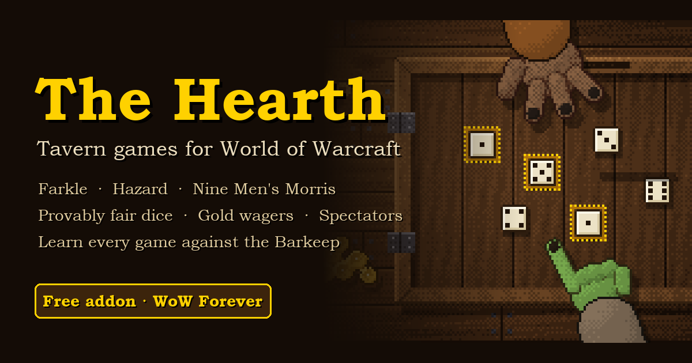

# The Hearth: downloads

**Tavern games for World of Warcraft.** Play **Farkle**, **Hazard** and
**Nine Men's Morris** with other players on a pixel-art tavern table. It has
provably fair dice, optional gold wagers, spectators, and a Barkeep who
teaches you the rules.

## ⬇️ Download

**[Get the latest version](https://github.com/XOData/TheHearth-releases/releases/latest)**.
Under *Assets*, click `TheHearth-….zip`.

Works on **WoW Forever**, **Classic Era** and **TBC Anniversary**.

## Install

1. Close WoW (or stay at the character select screen).
2. Open the zip. Inside is a folder called `TheHearth`.
3. Drag that folder into your AddOns folder:
   - WoW Forever: `World of Warcraft\_classic_beta_\Interface\AddOns\`
   - Classic Era: `World of Warcraft\_classic_era_\Interface\AddOns\`
   - TBC Anniversary: `World of Warcraft\_anniversary_\Interface\AddOns\`

   You should end up with `...\Interface\AddOns\TheHearth\TheHearth.toc`.
   If you get `TheHearth\TheHearth\...`, move the inner folder up one level.
4. Start WoW. On character select, click **AddOns** and make sure
   **The Hearth** is ticked.
5. In game, type **/hearth**. New? Try **/hearth learn farkle**.

**Auto-updates:** in [WoWUp](https://wowup.io), choose *Get Addons → Install
from URL* and paste `https://github.com/XOData/TheHearth-releases`.

## Updating

Download the new zip and replace the old `TheHearth` folder. Your ledger and
settings are kept (they live in your `WTF` folder, not the addon folder).

## Bugs

Type **/hearth bug** in game, describe what happened, click **Copy report**,
press Ctrl+C, then **[open a bug report](https://github.com/XOData/TheHearth-releases/issues/new/choose)**
and paste it. Reports contain no player names, and nothing is ever sent
automatically. Ideas are welcome there too.

Found a way to cheat? Please don't post it publicly. Use
[private reporting](https://github.com/XOData/TheHearth-releases/security/advisories/new) instead.

---

The Hearth is free. © 2026 XOData. All rights reserved. See [LICENSE](LICENSE).
